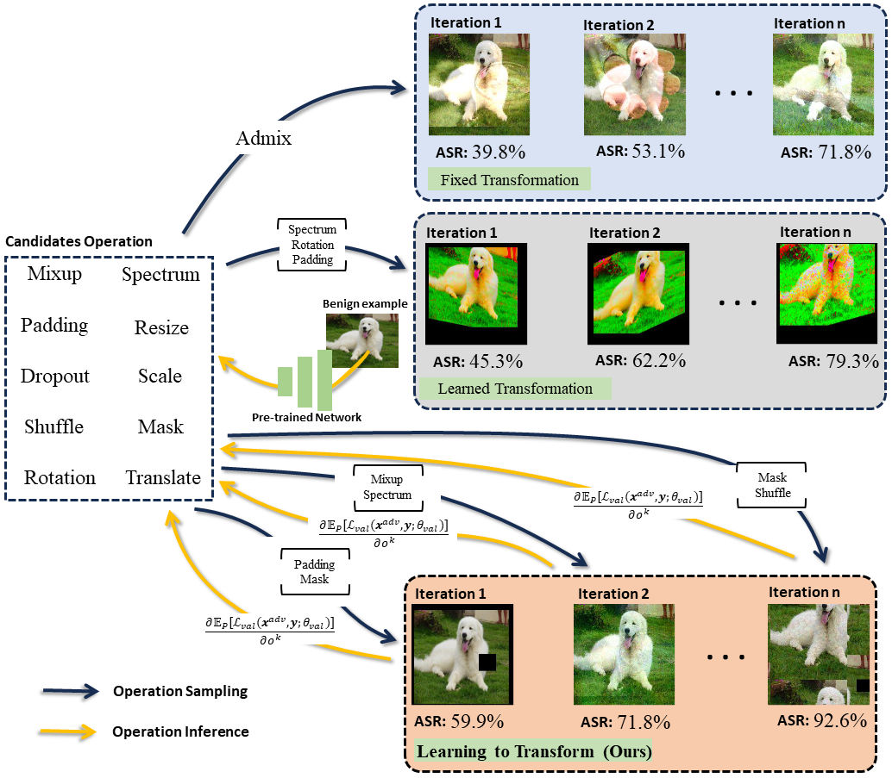

# Learning to Tranform Dynamically for Better Adversarial Transferability 





## Usage

### Installation
- Python >= 3.6
- PyTorch >= 1.21
- Torchvision >= 0.13.1
- timm >= 0.6.12

```bash
pip install -r requirement.txt
```
### Import clean examples
Following from previous works, we randomly selecte 1,000 images from ImageNet validation set to run our experiments. All images can be classified properly. You can also construct you own example sets by contrust your folder in the following format. 
```
data
├─images
│  ├─ILSVR2012_val_00000051.JPEG
│  ├─...
│  └─ILSVR2012_val_00001501.JPEG
└─labels.csv
```
labels.csv is a two colums table folloing the (filename,label) format as below
```
filename,label
ILSVRC2012_val_00013716.JPEG,0
```

### Generate adversarial examples


### Run for Evaluation


